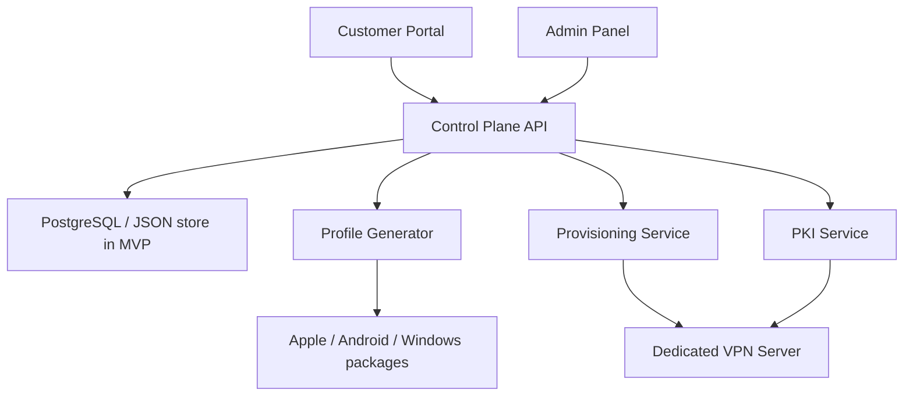
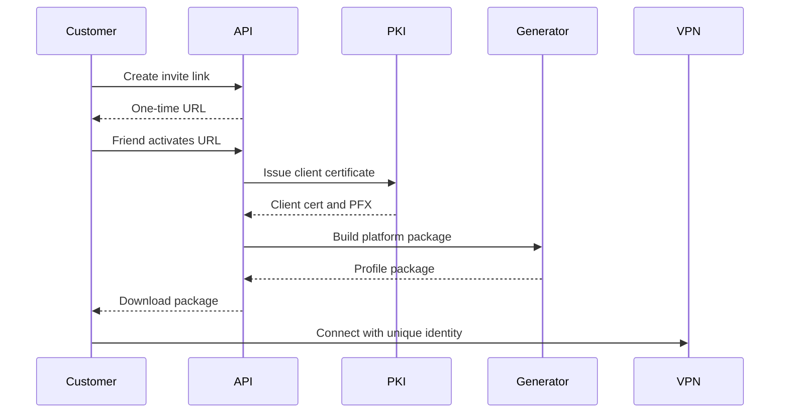

# Архитектура

## Общая схема

## MVP

В MVP вместо полноценной БД используется JSON-файл. Это упрощает запуск и позволяет показать бизнес-логику без инфраструктуры.

MVP-компоненты:

- `JsonStore` хранит клиентов, серверы, слоты, invite-ссылки и audit log.
- `ControlPlaneService` реализует правила продукта.
- `ProfileGenerator` создает VPN-пакеты под платформы.
- `DevPki` создает тестовые сертификаты через OpenSSL.
- `ServerConfig` генерирует пример `swanctl.conf`.

## Product version

В продуктовой версии JSON-store заменяется на PostgreSQL, а ручное создание VPS заменяется provisioning worker.

Целевые компоненты:

- API backend
- Admin panel
- Customer portal
- PostgreSQL
- Redis queue
- Provisioning workers
- PKI service
- Package generation workers
- Monitoring service
- Per-server metrics agent

## Главный lifecycle устройства

