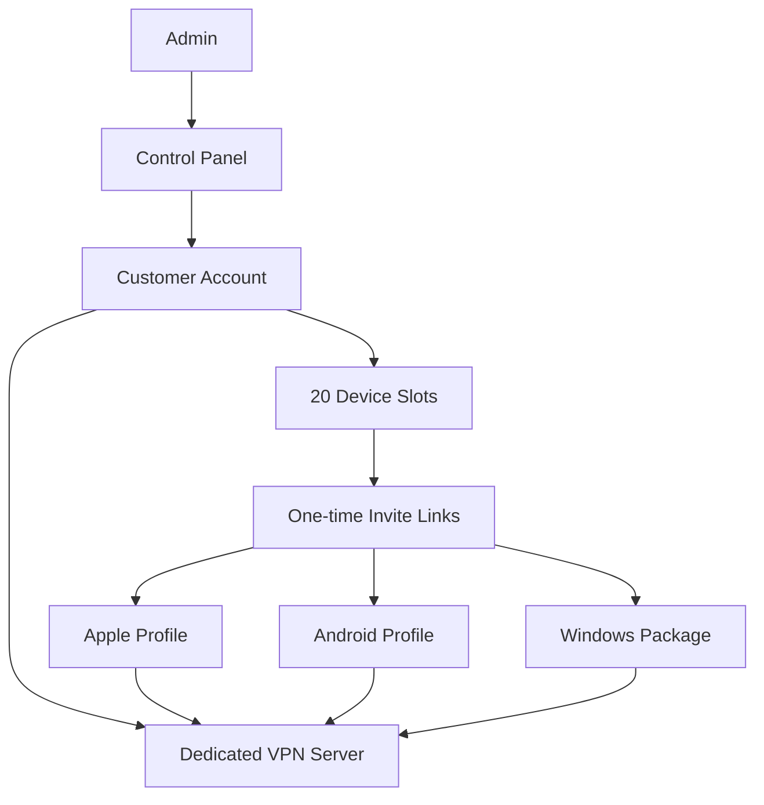
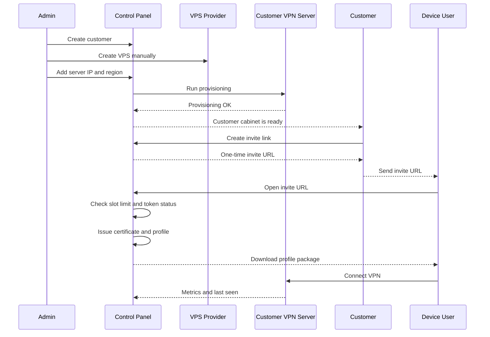
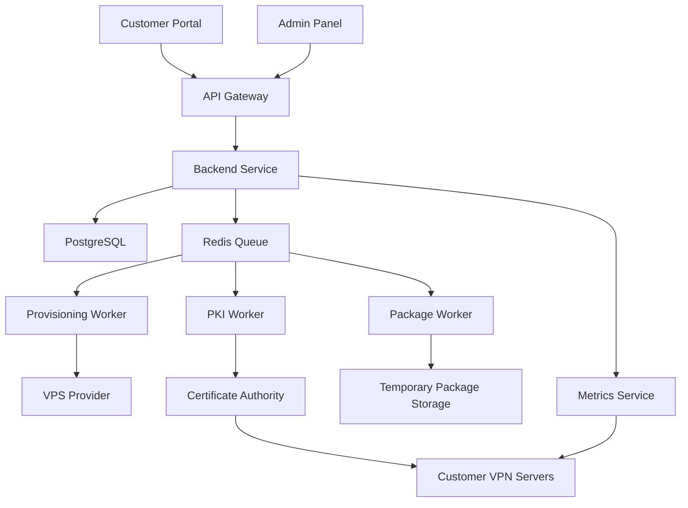

# Техническое задание: персональный VPN-сервис

Статус: черновик для MVP и последующей продуктовой архитектуры

---

## 1. Краткое описание

Сервис предоставляет персональный VPN для частных клиентов.

Главная идея: один платящий клиент получает отдельный выделенный сервер. Доступ к серверу выдается не одним общим файлом, а отдельными профилями для каждого устройства. Клиент может приглашать друзей через одноразовые ссылки. Каждая ссылка активирует один слот устройства и выдает уникальный VPN-профиль.

Базовая модель:

- `1 платящий клиент = 1 выделенный сервер`
- `1 устройство = 1 device slot`
- `1 device slot = 1 уникальный сертификат / профиль`
- `1 invite link = 1 одноразовая активация`
- `лимит MVP = до 20 зарегистрированных устройств`

Сервис не должен позиционироваться как антидетект, средство обхода анти-VPN-защит или инструмент сокрытия от сайтов, которые блокируют VPN. Для совместимости с сайтами, которые плохо работают через VPN, используется split tunnel: часть трафика идет через VPN, часть напрямую.

---

## 2. Цели продукта

### 2.1. Цели MVP

- Запустить рабочий персональный VPN-сервис для первых клиентов.
- Проверить, готовы ли клиенты платить за выделенный сервер.
- Проверить модель `20 device slots`.
- Проверить удобство одноразовых invite-ссылок.
- Проверить Apple-first UX через `.mobileconfig`.
- Собрать реальные данные по нагрузке, скорости, поддержке и частым проблемам.

### 2.2. Цели продуктовой версии

- Автоматизировать создание серверов.
- Автоматизировать выпуск сертификатов и профилей.
- Добавить полноценную клиентскую панель.
- Добавить продления, статусы подписки и отключение при неуплате.
- Поддержать Apple, Android и Windows в единой системе выдачи доступов.
- Добавить мониторинг серверов, слотов, подключений и трафика.
- Снизить ручную работу администратора до минимума.

---

## 3. Основные продуктовые решения

### 3.1. Серверная модель

- Каждый платящий клиент получает отдельный VPS.
- Сервер не делится между несколькими платящими клиентами.
- Локация MVP: Нидерланды, Амстердам.
- Провайдер MVP: VDSina или другой VPS-провайдер с аналогичными параметрами.
- Рекомендуемый тестовый тариф: `1 core / 2 GB RAM / 40 GB storage / 32 TB traffic`.

### 3.2. VPN-стек

Основной стек для MVP:

- `strongSwan`
- `IKEv2`
- certificate-based authentication
- `.mobileconfig` для Apple
- `.sswan` для Android через strongSwan VPN Client
- `PFX + PowerShell installer` для Windows

Причина выбора:

- Apple-устройства получают лучший UX без отдельного VPN-приложения.
- IKEv2 нативно поддерживается iOS и macOS.
- Сертификаты позволяют делать один профиль на одно устройство.
- Сертификаты можно отзывать.
- Можно контролировать одновременное использование одного профиля.

### 3.3. Device slots

В тарифе MVP есть `20` слотов.

Один слот означает:

- одно устройство
- один сертификат
- один профиль
- один набор учетных данных
- один активный VPN-сеанс одновременно

Если человек хочет использовать VPN на `iPhone`, `iPad` и `Mac`, это занимает `3` слота.

---

## 4. Термины

| Термин | Значение |
|---|---|
| Customer | Платящий клиент, владелец сервера |
| Device user | Человек, который подключает свое устройство по invite-ссылке |
| Device slot | Одно разрешенное устройство в рамках тарифа |
| Invite link | Одноразовая ссылка для активации нового устройства |
| Profile package | Файл или архив, который получает пользователь устройства |
| Full VPN | Режим, где весь трафик идет через VPN |
| Selective VPN | Режим, где через VPN идет только часть трафика |
| Revoke | Отзыв устройства и блокировка старого профиля |
| Control plane | Центральная система управления клиентами, профилями и серверами |
| Data plane | VPN-серверы клиентов |

---

## 5. Схема продукта

---

## 6. Роли пользователей

### 6.1. Администратор

Администратор управляет сервисом и клиентами.

Возможности администратора:

- создать клиента
- отметить оплату
- создать или подключить VPS
- запустить provisioning
- проверить статус сервера
- посмотреть слоты клиента
- отозвать устройство
- заблокировать клиента
- продлить подписку
- посмотреть журнал действий
- посмотреть ошибки выдачи профилей

### 6.2. Платящий клиент

Платящий клиент управляет своим сервером и слотами устройств.

Возможности клиента:

- видеть статус подписки
- видеть дату окончания оплаты
- видеть регион сервера
- видеть количество занятых и свободных слотов
- создавать одноразовые invite-ссылки
- отправлять ссылки друзьям
- видеть список подключенных устройств
- видеть последнюю активность устройства
- отключать устройство
- освобождать слот

### 6.3. Пользователь устройства

Пользователь устройства получает invite-ссылку от клиента.

Возможности пользователя устройства:

- открыть одноразовую ссылку
- выбрать платформу
- указать имя устройства
- скачать профиль
- установить профиль
- подключиться к VPN

---

## 7. MVP: границы проекта

### 7.1. В MVP входит

- отдельный сервер на клиента
- ручное или полуавтоматическое создание VPS
- установка и настройка strongSwan
- выпуск серверного сертификата
- выпуск отдельных сертификатов для устройств
- клиентский кабинет
- одноразовые invite-ссылки
- лимит `20` device slots
- выдача `.mobileconfig` для Apple
- выдача `.sswan` для Android
- выдача Windows-пакета с `PFX + install.ps1`
- revoke устройства
- basic monitoring
- basic billing status
- manual payment confirmation

### 7.2. В MVP не входит

- автоматическая покупка VPS через API провайдера
- автоплатежи
- мобильное приложение
- антидетект
- IP-ротация
- residential proxy
- shared VPN-серверы
- white-label для партнеров
- высокодоступная архитектура
- сложный пользовательский редактор split tunnel
- поддержка произвольных кастомных конфигураций клиентом

---

## 8. Основной сценарий MVP

---

## 9. Invite-ссылки

### 9.1. Правила invite-ссылки

- Ссылка создается клиентом.
- Ссылка одноразовая.
- Ссылка имеет срок жизни.
- Рекомендуемый срок жизни MVP: `24 часа`.
- После успешной активации ссылка становится недействительной.
- Если ссылка истекла, по ней нельзя получить профиль.
- Если у клиента нет свободных слотов, ссылка не должна создаваться.
- Если слот закончился между созданием и открытием ссылки, активация должна быть отклонена.

### 9.2. Состояния invite-ссылки

| Состояние | Значение |
|---|---|
| CREATED | Ссылка создана, еще не использована |
| USED | Ссылка использована |
| EXPIRED | Срок действия истек |
| REVOKED | Ссылка вручную отменена |
| FAILED | При активации произошла ошибка |

### 9.3. Активация invite-ссылки

При открытии ссылки пользователь видит:

- имя или название владельца VPN
- предупреждение, что ссылка одноразовая
- предупреждение, что будет занят один слот
- выбор платформы
- поле для имени устройства
- кнопку подтверждения

После подтверждения система:

- резервирует слот
- выпускает сертификат
- генерирует профиль
- помечает ссылку как использованную
- выдает файл
- записывает событие в audit log

---

## 10. Контроль шаринга одного файла

### 10.1. Проблема

Пользователь может скачать профиль для одного устройства и передать его другому человеку или поставить на другое свое устройство.

Пример:

- клиент скачал профиль для iPhone
- затем поставил тот же файл на Mac
- затем отправил этот же файл другу на iPad

Такого поведения нельзя полностью запретить на уровне файла, потому что `.mobileconfig`, `.sswan` и `PFX` являются переносимыми файлами.

### 10.2. Что система должна гарантировать

Система должна запретить нормальное одновременное использование одного профиля на нескольких устройствах.

Требования:

- один профиль привязан к одному device slot
- один device slot имеет один client identity
- один client identity может иметь только один активный VPN-сеанс
- повторное одновременное подключение с тем же identity блокируется
- попытка повторного использования логируется

### 10.3. Рекомендуемая политика strongSwan

Рекомендуемый режим: `unique = keep`.

Поведение:

- первое устройство подключилось
- второе устройство пытается подключиться с тем же профилем
- второе подключение отклоняется
- первое подключение остается активным
- событие пишется в журнал

Нежелательный режим: `unique = replace`.

Почему нежелательный:

- второе устройство сможет выбить первое
- человек, которому переслали файл, сможет мешать владельцу профиля

### 10.4. Ограничение

Система не может надежно доказать, что один и тот же профиль установлен на нескольких устройствах, если эти устройства не подключаются одновременно.

Например:

- iPhone подключен утром
- Mac подключен вечером тем же профилем
- одновременного подключения не было

В этом случае сервер увидит один identity, который подключался в разное время. Это можно считать подозрительным по IP, User-Agent активации, географии или частоте подключений, но это не является стопроцентным доказательством.

### 10.5. Что писать пользователю

В интерфейсе нужно явно указать:

- `Один профиль = одно устройство`
- `Для iPhone, iPad и Mac нужны отдельные слоты`
- `Если один и тот же профиль используется на двух устройствах, второе подключение будет отклонено`
- `Для нового устройства создайте новую invite-ссылку`

---

## 11. Платформенная выдача профилей

### 11.1. Apple

Поддерживаемые устройства:

- iPhone
- iPad
- Mac

Формат:

- `.mobileconfig`

Содержимое:

- IKEv2 VPN payload
- server FQDN
- remote identifier
- local identifier
- CA certificate
- client identity
- PKCS#12
- On Demand rules
- Full VPN или Selective VPN mode

Особенности:

- лучший UX среди всех платформ
- пользователь открывает профиль и устанавливает его через системные настройки
- отдельное VPN-приложение не требуется
- один и тот же формат профиля может быть установлен на разные Apple-устройства, поэтому контроль делается через slot и identity, а не через тип устройства

### 11.2. Android

Поддерживаемый путь MVP:

- strongSwan VPN Client
- импорт `.sswan`

Формат:

- `.sswan`

Содержимое:

- сервер
- IKEv2 параметры
- client identity
- CA certificate
- PKCS#12

Особенности:

- требуется установка приложения strongSwan VPN Client
- UX хуже Apple
- profile files не считаются защищенным контейнером
- скачивание должно быть одноразовым и короткоживущим

### 11.3. Windows

Поддерживаемый путь MVP:

- встроенный Windows VPN client
- certificate import
- PowerShell setup script

Формат:

- `.zip`

Содержимое:

- `client.pfx`
- `root-ca.cer`
- `install.ps1`
- `README.txt`

Особенности:

- UX хуже Apple
- может потребоваться запуск PowerShell с подтверждением
- в продуктовой версии желательно подписывать скрипт code-signing сертификатом
- нужно тестировать совместимость PFX на Windows 10 и Windows 11

---

## 12. Full VPN и Selective VPN

### 12.1. Full VPN

Весь трафик устройства идет через VPN.

Плюсы:

- проще объяснять
- проще тестировать
- меньше сложной логики

Минусы:

- некоторые сайты могут плохо работать через VPN
- банки, hh.ru, локальные сервисы и геозависимые сайты могут блокировать доступ

### 12.2. Selective VPN

Через VPN идет только выбранный набор трафика.

Плюсы:

- меньше проблем с сайтами, которые не любят VPN
- обычные сайты работают через домашний интернет пользователя
- меньше нагрузка на сервер

Минусы:

- нужно поддерживать списки доменов и маршрутов
- CDN и API-домены могут меняться
- на разных платформах разный UX

### 12.3. Решение для MVP

В MVP нужно поддержать:

- `Full VPN` как основной режим
- `Selective VPN` как отдельный профиль
- split-списки управляются администратором
- пользователь не редактирует split-списки сам

---

## 13. Provisioning сервера MVP

### 13.1. Создание VPS

На старте допустимо ручное создание VPS.

Рекомендуемые параметры:

- тип: стандартный VPS
- ОС: Ubuntu 22
- CPU: 1 core
- RAM: 2 GB
- storage: 40 GB
- traffic: 32 TB
- location: Amsterdam
- backups: off для тестов, включать позже по необходимости

### 13.2. Bootstrap сервера

Bootstrap должен:

- обновить систему
- создать системного пользователя
- настроить SSH
- установить strongSwan
- включить IP forwarding
- настроить firewall
- открыть нужные UDP-порты
- установить server certificate
- установить CA certificate
- настроить strongSwan
- настроить NAT
- настроить DPD
- настроить unique identity policy
- подключить сервер к monitoring

### 13.3. Smoke test

После provisioning система должна проверить:

- сервер доступен по SSH
- strongSwan запущен
- UDP 500 открыт
- UDP 4500 открыт
- домен резолвится в IP сервера
- server certificate установлен
- тестовый профиль подключается
- интернет через VPN работает

---

## 14. PKI и сертификаты

### 14.1. Главные правила

- root CA private key не хранится на VPN-сервере
- каждый сервер имеет свой server certificate
- каждое устройство имеет свой client certificate
- один client certificate не используется повторно для разных слотов
- revoke должен отключать конкретное устройство, не ломая остальные

### 14.2. Модель MVP

- offline root CA
- issuing intermediate CA на control plane
- server certificate на каждый customer server
- client certificate на каждый device slot
- CRL для отзыва сертификатов

### 14.3. Идентификаторы

Пример:

- customer id: `c123`
- server FQDN: `vpn-c123.example.com`
- device identity: `c123-d07`
- profile name: `VPN Client 123 Device 07`

### 14.4. Revoke

Revoke должен:

- пометить slot как revoked
- отозвать сертификат
- обновить CRL
- доставить CRL на сервер
- перезагрузить или обновить strongSwan
- записать событие в audit log

---

## 15. Модель данных

### 15.1. customers

| Поле | Тип | Описание |
|---|---|---|
| id | uuid | ID клиента |
| name | text | Имя клиента |
| contact | text | Telegram, email или телефон |
| status | text | ACTIVE, PAUSED, BLOCKED |
| created_at | timestamp | Дата создания |

### 15.2. subscriptions

| Поле | Тип | Описание |
|---|---|---|
| customer_id | uuid | Клиент |
| plan | text | Тариф |
| paid_until | timestamp | Оплачено до |
| grace_until | timestamp | Льготный период |
| status | text | ACTIVE, PAST_DUE, SUSPENDED |

### 15.3. servers

| Поле | Тип | Описание |
|---|---|---|
| id | uuid | ID сервера |
| customer_id | uuid | Клиент |
| provider | text | VDSina |
| region | text | Amsterdam |
| ip | inet | IP сервера |
| fqdn | text | Домен сервера |
| status | text | PROVISIONING, ACTIVE, ERROR, SUSPENDED |
| created_at | timestamp | Дата создания |

### 15.4. device_slots

| Поле | Тип | Описание |
|---|---|---|
| id | uuid | ID слота |
| customer_id | uuid | Клиент |
| server_id | uuid | Сервер |
| slot_number | integer | Номер 1..20 |
| status | text | FREE, RESERVED, ACTIVE, REVOKED |
| platform | text | APPLE, ANDROID, WINDOWS |
| device_name | text | Имя устройства |
| identity | text | strongSwan identity |
| last_seen_at | timestamp | Последняя активность |
| last_ip | inet | Последний IP |
| bytes_in | bigint | Входящий трафик |
| bytes_out | bigint | Исходящий трафик |

### 15.5. invite_tokens

| Поле | Тип | Описание |
|---|---|---|
| id | uuid | ID ссылки |
| customer_id | uuid | Клиент |
| token_hash | text | Hash токена |
| status | text | CREATED, USED, EXPIRED, REVOKED |
| expires_at | timestamp | Срок действия |
| used_at | timestamp | Когда использована |
| used_by_ip | inet | IP активации |

### 15.6. certificates

| Поле | Тип | Описание |
|---|---|---|
| id | uuid | ID сертификата |
| slot_id | uuid | Слот |
| serial | text | Serial number |
| fingerprint | text | Fingerprint |
| common_name | text | CN |
| issued_at | timestamp | Выпущен |
| revoked_at | timestamp | Отозван |

### 15.7. audit_log

| Поле | Тип | Описание |
|---|---|---|
| id | uuid | ID события |
| actor_type | text | ADMIN, CUSTOMER, SYSTEM |
| actor_id | uuid | Кто совершил действие |
| action | text | Действие |
| target_type | text | Тип объекта |
| target_id | uuid | ID объекта |
| payload | jsonb | Детали |
| created_at | timestamp | Дата |

---

## 16. API MVP

### 16.1. Public API

- `GET /invite/:token`
- `POST /invite/:token/activate`
- `GET /download/:download_token`
- `GET /health`

### 16.2. Customer API

- `GET /me`
- `GET /me/subscription`
- `GET /me/server`
- `GET /me/slots`
- `POST /me/invites`
- `DELETE /me/invites/:id`
- `POST /me/slots/:id/revoke`
- `POST /me/slots/:id/reissue`
- `GET /me/activity`

### 16.3. Admin API

- `POST /admin/customers`
- `GET /admin/customers`
- `GET /admin/customers/:id`
- `POST /admin/customers/:id/renew`
- `POST /admin/customers/:id/suspend`
- `POST /admin/customers/:id/server`
- `POST /admin/servers/:id/provision`
- `GET /admin/servers/:id/status`
- `POST /admin/slots/:id/revoke`
- `GET /admin/audit`

---

## 17. Background jobs

Фоновые задачи:

- `provision_server`
- `issue_device_certificate`
- `generate_apple_profile`
- `generate_android_profile`
- `generate_windows_package`
- `publish_crl`
- `expire_invites`
- `expire_download_links`
- `collect_server_metrics`
- `collect_device_sessions`
- `send_subscription_reminders`
- `suspend_overdue_servers`

---

## 18. Клиентский кабинет

### 18.1. Главный экран

Показывает:

- статус подписки
- дата окончания оплаты
- регион сервера
- статус сервера
- количество занятых слотов
- количество свободных слотов
- кнопка `Создать ссылку`

### 18.2. Экран устройств

Показывает:

- номер слота
- имя устройства
- платформа
- статус
- последняя активность
- последний IP
- трафик
- конфликты использования профиля
- кнопка `Отключить`

### 18.3. Экран invite-ссылок

Показывает:

- активные ссылки
- срок жизни
- статус
- кнопка отмены

---

## 19. Админка

Админка должна позволять:

- найти клиента
- посмотреть сервер
- увидеть статусы слотов
- увидеть ошибки provisioning
- увидеть последний health check
- продлить подписку
- заблокировать клиента
- отозвать устройство
- перевыпустить пакет
- посмотреть audit log

---

## 20. Мониторинг

### 20.1. Метрики сервера

- CPU
- RAM
- disk
- network in/out
- uptime
- strongSwan status
- active IKE_SA
- active CHILD_SA

### 20.2. Метрики устройств

- last seen
- active / inactive
- bytes in
- bytes out
- duplicate attempts
- auth failures

### 20.3. Алерты

- сервер недоступен
- strongSwan упал
- истекает подписка
- много auth failures
- много duplicate attempts
- резкий рост трафика
- диск почти заполнен

---

## 21. Безопасность

Обязательные требования:

- HTTPS везде
- SSH только по ключу
- root login disabled
- firewall по умолчанию закрыт
- открыты только нужные порты
- invite-токены хранятся только в hash-виде
- download links короткоживущие
- audit log для всех критичных действий
- секреты не пишутся в logs
- root CA offline
- уникальный сертификат на каждое устройство
- revoke конкретного устройства без влияния на остальные

---

## 22. Подписка и отключение

### 22.1. Состояния подписки

| Состояние | Значение |
|---|---|
| ACTIVE | Подписка активна |
| PAST_DUE | Оплата просрочена |
| GRACE | Льготный период |
| SUSPENDED | Сервер заблокирован |
| CANCELLED | Клиент отключен |

### 22.2. Поведение при просрочке

- За 7 дней отправить напоминание.
- За 3 дня отправить напоминание.
- За 1 день отправить напоминание.
- После окончания оплаты включить grace period.
- В grace period оставить текущие устройства рабочими, но запретить новые invite-ссылки.
- После grace period отключить сервер или заблокировать VPN.
- Через 30 дней удалить сервер, если клиент не оплатил.

---

## 23. Product architecture

После MVP система должна быть разделена на control plane и data plane.

### 23.1. Control plane

Отвечает за:

- клиентов
- подписки
- серверы
- слоты
- invite-ссылки
- сертификаты
- профили
- revoke
- мониторинг
- аудит

### 23.2. Data plane

Состоит из клиентских VPN-серверов.

Каждый сервер:

- обслуживает одного клиента
- имеет свой FQDN
- имеет свой server certificate
- принимает подключения только по действительным client certificates
- отправляет метрики в control plane

### 23.3. Provisioning service

В продуктовой версии должен:

- создавать VPS через API провайдера
- назначать hostname
- обновлять DNS
- ставить strongSwan
- настраивать firewall
- ставить сертификаты
- делать smoke test
- регистрировать сервер как active

### 23.4. PKI service

В продуктовой версии должен:

- выпускать server certificates
- выпускать client certificates
- вести serial inventory
- отзывать сертификаты
- публиковать CRL
- вести audit всех операций

### 23.5. Package generator

Генерирует:

- `.mobileconfig`
- `.sswan`
- `.zip` для Windows
- README-файлы
- short-lived download links

---

## 24. Roadmap

### Этап 1. Concierge MVP

- ручное создание VPS
- bootstrap-скрипт
- базовая админка
- клиентский кабинет
- Apple `.mobileconfig`
- invite-ссылки
- 20 slots
- revoke
- basic monitoring

### Этап 2. MVP+

- Android `.sswan`
- Windows package
- basic billing reminders
- split profile для Apple
- duplicate usage events
- traffic metrics

### Этап 3. Автоматизация

- автоматическое создание VPS
- автоматический DNS
- автоматический provisioning
- PKI service
- CRL propagation
- server health checks

### Этап 4. Продуктовая версия

- автоплатежи
- тарифы
- апгрейды слотов
- self-service регионы
- расширенный split tunnel
- полноценный monitoring
- support tools

---

## 25. Acceptance criteria MVP

MVP считается готовым, если:

- админ может создать клиента
- клиенту можно выдать отдельный сервер
- сервер успешно поднимает strongSwan
- клиент видит кабинет
- клиент может создать invite-ссылку
- invite-ссылка одноразовая
- после активации создается уникальный сертификат
- для Apple генерируется рабочий `.mobileconfig`
- для Android генерируется рабочий `.sswan`
- для Windows генерируется рабочий package
- один профиль не может одновременно работать на двух устройствах
- revoke отключает конкретное устройство
- 21-й слот не создается при лимите 20
- в кабинете видна последняя активность устройства
- просроченная подписка запрещает создание новых invite-ссылок

---

## 26. Тексты для интерфейса

### 26.1. Создание invite-ссылки

`Ссылка одноразовая. После активации она займет один слот устройства. Не отправляйте ссылку нескольким людям одновременно.`

### 26.2. Установка профиля

`Один профиль предназначен только для одного устройства. Если установить этот же профиль на другое устройство, одновременное подключение будет отклонено.`

### 26.3. Лимит слотов

`Лимит устройств исчерпан. Чтобы подключить новое устройство, отключите одно из существующих или увеличьте тариф.`

### 26.4. Revoke

`После отключения устройства старый профиль перестанет работать. Для повторного подключения нужно создать новую ссылку.`

---

## 27. Риски

Основные риски:

- Windows UX может быть слишком сложным для массового клиента.
- Android требует отдельного приложения.
- Пользователи могут путать `20 устройств` и `20 человек`.
- Клиенты могут ожидать обход анти-VPN блокировок.
- Split tunnel потребует поддержки списков.
- Ручное создание серверов быстро станет узким местом.
- Abuse-жалобы от провайдера могут потребовать быстрых блокировок.
- Нужно заранее проверить правовые требования к платному VPN-сервису.

---

## 28. Документация для разработки

strongSwan:

- https://docs.strongswan.org/docs/latest/interop/ios.html
- https://docs.strongswan.org/docs/latest/interop/appleIkev2Profile.html
- https://docs.strongswan.org/docs/latest/os/androidVpnClient.html
- https://docs.strongswan.org/docs/latest/os/androidVpnClientProfiles.html
- https://docs.strongswan.org/docs/latest/swanctl/swanctlConf.html
- https://docs.strongswan.org/docs/latest/swanctl/swanctlListSas.html
- https://docs.strongswan.org/docs/latest/pki/pkiQuickstart.html

Apple:

- https://support.apple.com/en-euro/guide/deployment/dep4ce9487d/web
- https://support.apple.com/en-euro/guide/deployment/depae3d361d0/web

Microsoft:

- https://support.microsoft.com/en-us/windows/connect-to-a-vpn-in-windows-3d29aeb1-f497-f6b7-7633-115722c1009c
- https://learn.microsoft.com/en-us/powershell/module/vpnclient/add-vpnconnection
- https://learn.microsoft.com/en-us/powershell/module/pki/import-pfxcertificate
- https://learn.microsoft.com/en-us/windows/client-management/mdm/vpnv2-csp

